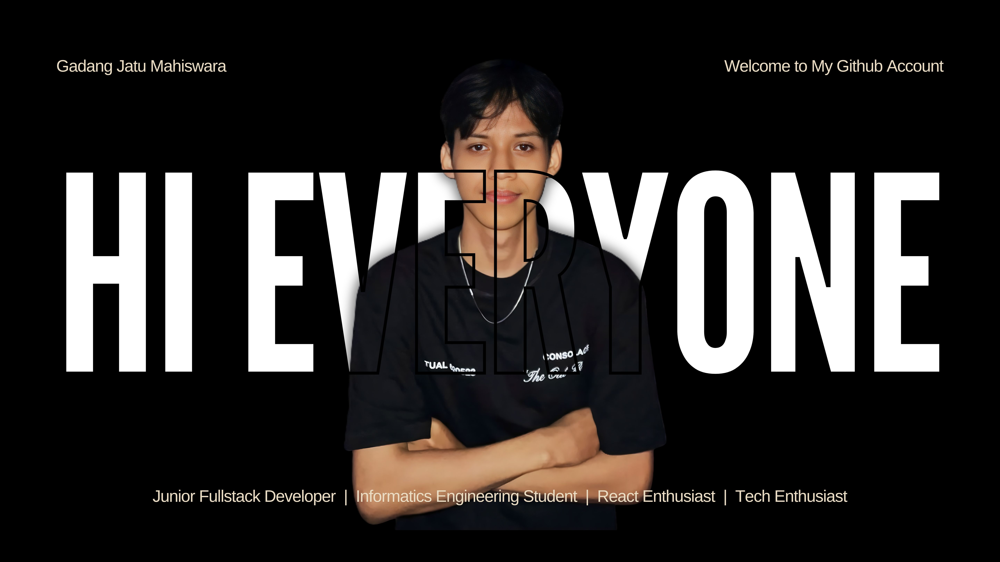

# Hi there, I'm Gadang! 👋

I have a strong foundation in full-stack web development, and I'm actively seeking internship opportunities. I believe that an exceptional user interface and a robust backend architecture form the best foundation for delivering impactful data insights.

---

## Let's Connect!

Feel free to reach out if you'd like to collaborate, discuss ideas, or just say hi!

  
  &nbsp;&nbsp;&nbsp;&nbsp;
  
  &nbsp;&nbsp;&nbsp;&nbsp;
  
  &nbsp;&nbsp;&nbsp;&nbsp;
  

---

  
## What I'm Currently Focusing On

- **Frontend Craftsmanship:** Deepening my expertise in the React ecosystem to deliver responsive, animation-rich user interfaces.
- **Backend Engineering:** Designing robust RESTful APIs and comprehensive management dashboards.
- **Data & AI Initiatives:** Building analytical platforms like the Mining Value Chain Optimization tool powered by Agentic AI.

---

## Tech Stack & Tools

---

  
## GitHub Stats

---
